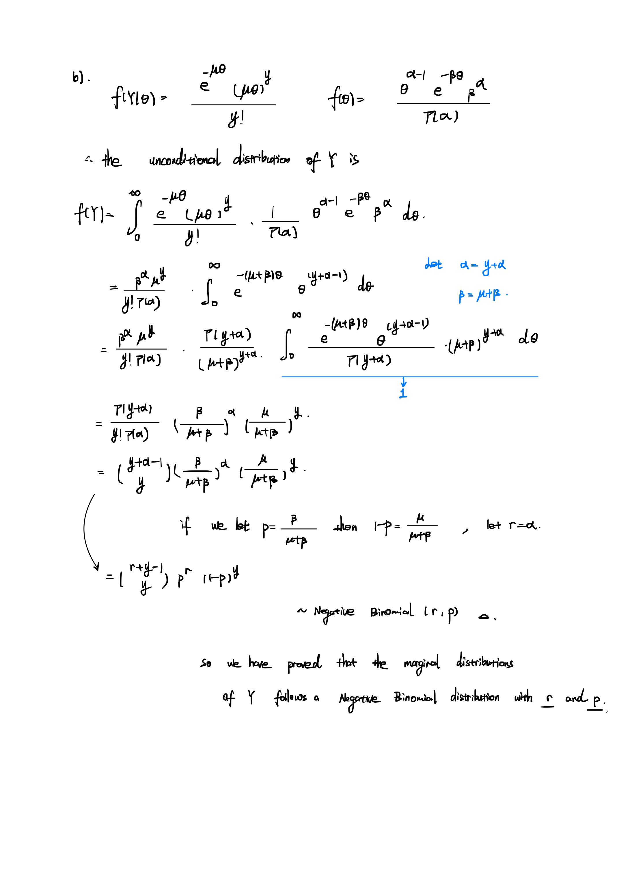

**Due:** 11:59pm, 3 February 2023

**What to hand in:** .qmd or .Rmd file and the compiled pdf

**How to hand in:** Submit files via Quercus

# Overdispersion

```{r}
#| message: false
library(tidyverse)
```

Suppose that the conditional distribution of outcome $Y$ given an unobserved variable $\theta$ is Poisson, with a mean and variance $\mu\theta$, so

$$
Y|\theta \sim  \text{Poisson}(\mu\theta)
$$

a)  **Assume** $E(\theta) = 1$ **and** $Var(\theta) = \sigma^2$**. Using the laws of total expectation and total variance, show** $E(Y) = \mu$ **and** $Var(Y) = \mu (1+ \mu\sigma^2)$**.**

    

b)  **Assume** $\theta$ **is Gamma distributed with** $\alpha$ **and** $\beta$ **as shape and scale parameters, respectively. Show the unconditional distribution of** $Y$ **is Negative Binomial.**

    

c)  **In order for** $E(Y) = \mu$ **and** $Var(Y) = \mu (1+ \mu\sigma^2)$**, what must** $\alpha$ **and** $\beta$ **equal?**

    

\newpage

# Hurricanes

In 2014 the following paper was published in PNAS:

> Jung, K., Shavitt, S., Viswanathan, M., & Hilbe, J. M. (2014). Female hurricanes are deadlier than male hurricanes. Proceedings of the National Academy of Sciences, 111(24), 8782-8787.

As the title suggests, the paper claimed that hurricanes with female names have caused a greater loss of life. In this question you will be investigating the data set used for the regression part of their analysis.

You can download the data from the paper's supporting information here: <https://www.pnas.org/doi/10.1073/pnas.1402786111#supplementary-materials>

You should skim the whole paper but you will probably find it useful to read the sections on the Archival Study in the most depth (both in the main text and 'Materials and Methods' section).

**let's first read in the dataset, and take a look at the head of the dataset:**

```{r}
library("readxl")
hurri <- read_xlsx('pnas.1402786111.sd01.xlsx') # notice that only the first 92 rows contain useful datas, the rest are summaries made by author
hurri <- hurri[1:92,]
head(hurri)
```

a)  **Create three graphs in ggplot that help to visualize patterns in deaths by femininity, minimum pressure, and damage. Discuss what you observe based on your visualizations.**

Let's first plot the patterns in deaths by Femininity, by using the parameter alldeaths (number of total death as explained by the author), and the parameter ZMasFem (normalized mass of Femininity). The graph looks like the following:

```{r}

p <-ggplot(data = hurri, aes(x = ZMasFem, y = alldeaths))
p+
  geom_point(color = 'firebrick4')+
  labs(title = 'Patterns in Deaths by standardized mass of Femininity',
       x = 'Standardized Mass of Femininity',
       y = 'Deaths Number')+
  theme_bw(base_size = 14)
```

It can be seen that when the standardize mass of femininity is in general near zero, for ex. in the region between [-1,1] (i.e. when the femininity is neutral) the number of death is relatively small. and when the standardize mass of femininity is on the right (more femininity) and left(less femininity) tail, the death number seems to rise. Another pattern is that we see more severe (i.e. more death) outliers in hurricanes with higher standardized mass of femininity.

Now in terms of patterns between number of death and minimum pressure, let's take a look at the parameter alldeaths, and ZMinPressure_A (the standardized minimum pressure of the hurricane):

```{r}

p <-ggplot(data = hurri, aes(x = ZMinPressure_A, y = alldeaths))
p+
  geom_point(color = 'firebrick4')+
  labs(title = 'Patterns in Deaths by standardized minimum of pressure',
       x = 'Standardized minimum of pressure',
       y = 'Deaths Number')+
  theme_bw(base_size = 14)
```

As shown in the graph, the general pattern is that when the standardized pressure is above 0, number of death is in general small with a few outliers. However, when standardized pressure is below zero, it seems like the number of death is negatively correlated with that of standardized pressure: while standardized pressure decreases, the hurricane is more deadly from the data.

Finally, let's investigate the pattern between alldeaths, and ZNDAM (the standardized damage dealt by each hurricane):

```{r}

p <-ggplot(data = hurri, aes(x = ZNDAM, y = alldeaths))
p+
  geom_point(color = 'firebrick4')+
  labs(title = 'Patterns in Deaths by standardized damage dealt by hurricanes',
       x = 'Standardized damage',
       y = 'Deaths Number')+
  theme_bw(base_size = 14)
```

as we can see, it is about a 50% likelihood that such such relationship is positively correlated with the standardized damage, with some cases where the number of death does not increase with corresponding to the standardized damage. However, when some severe damage has been done, the death number is most likely high (around 100 deaths) as well.

b)  **Run a Poisson regression with `deaths` as the outcome and `femininity` as the explanatory variable. Interpret the resulting coefficient estimate. Check for overdispersion. If it is an issue, run a quasi-Poisson regression with the same variables. Interpret your results.**

Let's fit the regression model first, and take a look at the summary statistics, the two parameters that I used to fit the models are alldeaths and ZMasFem.

```{r}
model1 <- glm(alldeaths~ZMasFem, family=poisson(link = "log"),data=hurri)
summary(model1)
```

This result means that, controlling other variables constant, with one unit increment of Standardized Femininity, the log expected change of number of death is going to increase by 0.23840, or in other words, it is going to increase by 1.269 units.

Now to check for Overdispersion: we find the overdispersion parameter using the formula from lecture slides: we see that the overdispersion factor is:

```{r}
n <- 92
k <- 2
stand_res <- rstandard(model1)
disp <- 1/(n-k) * sum(stand_res^2)
print(disp)
```

with a probability degree of freedom = 92-2 = 90

and the following Probability that we observe a factor at least as big as this is

```{r}
1- pchisq(sum(stand_res^2), n-k)

```

This is troublesome as this means that this factor is not representing the correct death number from the data, therefore, we will try to fit using a quasi-Poisson model, and let's take a look at its summary:

```{r}
model2 <- glm(alldeaths~ZMasFem, family=quasipoisson,data=hurri)
summary(model2)
```

As people might notice, the parameter ZMasFem here is no longer significant in the quasi poisson distribution, the interpretation of the parameter ZMasFem will be the same, but instead of assuming an equal variance compared to mean from the sample, this model assumes the variance as proportional to mean, giving more flexibility to the model.

c)  **Reproduce Model 4 (as described in the text and shown in Table S2).**[^1] **Report the estimated effect of femininity on deaths assuming a hurricane with median pressure and damage ratings.**

[^1]: **I was able to reproduce the coefficient estimates using the data available but the standard errors were slightly different, so don't worry if that is what you find.**

Let's reproduce the model using the parameters that was described in the paper, that is, as I quote from the original paper:

"Finally, we standardized minimum pressure, MFI, and normalized damage variables and created interaction variables as in model 3" "interactions between MFI and minimum pressure and MFI and normalized damage."

To fit a Negative Binomial Regression as the author did in the paper, I used the MASS library, and named it model4 (although it should be named model3 if I'm using my own numbering of the model XD)

```{r}
library(MASS)
model4 <- glm.nb (alldeaths ~ ZMinPressure_A + ZMasFem + ZNDAM + ZMasFem*ZMinPressure_A + ZMasFem*ZNDAM , data = hurri)
summary(model4)
```

Let's also find the median of ZMinPressure and ZNDAM

```{r}
paste('median of ZMinPressure_A is:', round(median(hurri$ZMinPressure_A),4))
paste('median of ZNDAM is:', round(median(hurri$ZNDAM),4))
```

To report the effect of the parameter Femininity, we could say: Controlling the standardized damge and standardized minimum pressure, with 1 unit increase of the standardized Femininity, we are expecting a $0.1723+0.3948(-0.0724)+0.7051(-0.4345) \approx -0.1626$ increase in the log of number of death created by the hurricane. (which is approximately 0.85 decrement in the actual death number).

d)  **Using Model 4, predict the number of deaths caused by Hurricane Sandy. Interpret your results.**

Let's first do the prediction:

```{r}
model4 |> predict(hurri |> filter(Name == 'Sandy')) |> exp()

```

This means the expected number of death by model4 caused by Hurricane Sandy is

    20806.74 

.

The true number of death caused by Sandy is:

```{r}
hurri |>
  filter(Name =='Sandy')
```

which is 159, this means that the model is not very well in predicting outlier-like hurricanes.

e)  **Describe at least two strengths and two weaknesses of this paper, focusing on the archival analysis. What was done well? What needed improvement?**

Two Strengths:

-   The paper has done well in terms of data processing, that includes normalizing the Femininity, Damage dealt, and minimum Pressure, and it has done a good job to find the appropriate parameters to fit, for example, the maximum pressure data was not collected until 1970s so they have removed such data.

-   The paper has done well in determining what models to use, and detection of over-dispersion, which is quite often in my experience diagnosed. In the end model4, you can see that they provide a good estimate of Femininity with a comparatively more significance compare to that of the original quasi-poisson regression. And the interaction terms between damage and femininity, minimum pressure and femininity are significant.

Two Weakness:

-   In addition to my previous points, the paper has proved that the interaction term between damage and femininity, minimum pressure and femininity are significant. However, the femininity itself is not significant. By this way, people may argue that these significance is caused by the significance of minimum pressure and damage itself.

-   Another weakness of the paper is the existence of too many outliers compare to the data size. As we see, from a), a very large proportion of the data has very small death counts, with a few very large outliers on both end, this will significantly decrease the significance of femininity.

f)  **Are you convinced by the results? If you are, explain why. If you're not, describe what additional data and/or analyses you would like to see to further test the author's hypothesis.**

I am not convinced by the results for following reasons:

-   the fact that they collect the most important parameter 'Femininity' by a blind survey from 9 people, is not convincing, there should be some literature review on the feasibility of this approach. And if decided to be feasible, there should be more people involve in the data collection process.

-   The fact that in the end the author has proved the interaction effects between femininity and others are significant, but the femininity itself is not significant, is questionable. There should have been more data cleansing process, and more samples could be introduced to increase the significance.

-   etc...there's several more I could think of yesterday...but completely forgot when I typed this up today...

\newpage

# Vaccinations

This question relates to COVID-19 vaccination rates in the United States. We are interested in exploring factors that are associated with differences in vaccine coverage by US county.

-   You can download the latest data on vaccination coverage here: <https://data.cdc.gov/Vaccinations/COVID-19-Vaccinations-in-the-United-States-County/8xkx-amqh/data>. Note that this is updated most days so depending on when you download it, it might be slightly different from others (that's okay). For the purposes of the assignment, please consider data from the 11th of January 2023. Also note that on the same webpage you should be able to find a data dictionary. We will be interested in people who have completed a primary vaccine series (have second dose of a two-dose vaccine or one dose of a single-dose vaccine), which refers to columns that have the `Series_Complete` prefix.

By looking into the dictionary (which is also saved to this uploaded .zip file), I was able to find out that the parameter we should be looking at is the "Series_Complete_Yes", and I have filtered out the data starting from 11th of January 2023, and filtered out the data with Series_Complete_Yes = 0. Reading them in:

```{r}
covid <- read_csv('COVID.csv')
head(covid)
```

-   The class repo has a dataset `acs` that contain a range of different demographic, socioeconomic, and health variables by county. These were obtained from the American Community Survey (ACS) via the R package `tidycensus`. For reference, the extraction code can be found in the repo (`acs.R`)

Let's also read this data in:

```{r}
acs <- read_csv('acs.csv', show_col_types = FALSE)
head(acs)
```

seems like the data needs a bit reformatting, let's use the function spread:

```{r}
acs <- acs |> pivot_wider(names_from = 'variable', values_from = 'value')
head(acs)
```

and we can left-join acs and covid:

```{r}
dc <-left_join(covid, acs, by = c("FIPS" = 'fips'))
head(dc)
```

a)  **Perform some exploratory data analysis (EDA) using a dataset combining the vaccination and ACS data, and summarize your observations with the aid of 3-4 key tables or graphs.**

let's start by picking some variable of interest, and name this dataset dp, for EDAs:, and also creating a new column called **total_18plus_pct to represent the ratio of people age 18 plus's ratio of primary vaccination finished.**

```{r}
dp <- dc |> dplyr :: select(Date:Completeness_pct, 
                            Series_Complete_Yes, 
                            Series_Complete_18Plus ,
                            total_pop_18plus:prop_low_ratio_ip ) |> 
            dplyr :: mutate(total_18plus_pct = Series_Complete_18Plus/total_pop_18plus) |>
            dplyr :: filter(total_18plus_pct <= 1)
head(dp)
```

let's start by draw a histogram of the Series_Complete_18Plus to see what kind groups are there: (which is our major response variable I was asssuming...) notice that when drawing the histogram, I have to filter out a few counties who has a percentage of population completion ratio higher than 1, which I didn't look too deep into it, but I was assuming there's some data collection bias in those 4 counties.

```{r}
dp |> 
  ggplot(aes(x=total_18plus_pct ))+
  geom_histogram(binwidth = 0.05, 
                 na.rm = TRUE,
                 color="darkblue",  
                 alpha=0.6, 
                 fill="#D55E00")+
  labs(title = 'Histogram of percentage of vaccine completion for 18 and older', y = 'frequency')+
  theme_classic()
```

As it can be see, the complete rate mostly follows a normal distribution, with a slightly shift in the mean value.

Let's also draw a quick correlation heat map

```{r}
library(reshape2)
cor_dp <- dp |> 
  dplyr :: select(Completeness_pct:total_18plus_pct)

corr <- round(cor(cor_dp,use = "complete.obs"),2) |> melt()
ggplot(data = corr, aes(x=Var1, y=Var2, fill=value)) + 
  geom_tile()+
  labs(title = 'Heatmap of the correlation matrix between different variables') +
  theme(axis.text.x = element_text(angle = 90, vjust = 0.45, hjust=0.4), axis.title.x=element_blank(), axis.title.y=element_blank())
```

By looking at the heat-map of the correlation matrix, It is easy to see that total_18plus_pct is somewhat correlated with prop_white, median_age, prop_less_than_hs, prop_nilf, and prop_low_ratio_ip, we can consider all these factors in the model fitting in the next steps. For example, let's take a look at the correlation between total_18plus_pct and prop_nilf (proportion of population age 16+ who are not in labor force).

```{r}
ggplot(data = dp, aes(x=total_18plus_pct, y=prop_nilf)) +
  geom_point(size=2, shape=23,na.rm = TRUE) +
  labs(title = 'Corrlation between Series_Complete_Yes and total_pop_18plus')+
  theme_classic()
  
```

As shown from the correlation plot, the correlation is not obvious by inspection, so maybe we can look into the significance later on in the model fitting stage.

Some interesting fact is that it can be seen that the number of series complete is strongly correlated to that of the total_pop_18plus, and somewhat negatively correlated with the prop_white, this is interesting, let's further investigate this:

Looking at the scatter plot between Series_Complete_Yes and total_pop_18plus:

```{r}
ggplot(data = dp, aes(x=Series_Complete_Yes, y=total_pop_18plus)) +
  geom_point(size=2, shape=23,na.rm = TRUE) +
  labs(title = 'Corrlation between Series_Complete_Yes and total_pop_18plus')+
  theme_classic()
  
```

Note that this is very interesting...by looking at the dictionary bank: Series_Complete_Yes is Total count of people who completed a primary series in the county, and total_pop_18plus is total population aged 18+ years in the following county, I am very surprised to see these two are highly correlated.

Let's also looked at the negatively correlated Series_Complete_Yes with median_age and prop_white:

```{r}
ggplot(data = dp, aes(x=Series_Complete_Yes, y=prop_white)) +
  geom_point(size=2, shape=23,na.rm = TRUE) +
  scale_x_log10()+
  labs(title = 'Corrlation between Series_Complete_Yes and prop_white')+
  theme_classic()
  
```

note that the graph above is transformed at a log scale because of the existence of outliers, and as we can see, it does show some slight negative correlation, but not as strong as the total_pop_18plus.

b)  **Build a regression model at the county level to help investigate patterns in the full vaccination rate for the population aged 18+ (that is, people aged 18+ who have completed a primary vaccine series). There is no one right answer here, but you should justify the outcome measure you are using (e.g. counts, proportions, rates, etc) and your distributional assumptions about the outcome measure (e.g. binary, poisson, normal, etc). You should also discuss briefly your model building strategy; what covariates you considered and why (motivated by your EDA)**[^2], **and how the candidate model was chosen. Interpret your findings, including visualizations where appropriate**.

[^2]: **Note that the vaccines dataset also has a `Metro` variable which you are welcome to use in your analyses.**

To start with this question, let's clarify the **response variable** here:

The response variable I used here for model fitting is total_18plus_pct, which is the percentage of primary vaccine series completion ratio in population with age 18 and plus. (this value is calculated by taking **Series_Complete_18Plus divided by total_pop_18plus, so it is a ratio value**)

As we can see in the previous histogram plot, the distribution is population related and follows nearly a shifted-mean version of normal distribution, so the distributional assumption on the data would **normal**.

Let's first start a full nested model and see the summary result: (I didn't include the factor of county name and states name as there's too many factor levels then...) and note that Series_Complete_18Plus and total_pop_18plus is used to calculate total_18plus_pct, so they were removed to prevent multi-colinearity.

```{r}
my_data <- dp |> dplyr::select(Completeness_pct:Series_Complete_Yes, prop_white: total_18plus_pct)
model5 <- lm(total_18plus_pct ~ .,  data = my_data)
summary(model5)
```

It can be seen that Series_Complete_Yes and prop_less_than_hs are not that significant, using Stepwise selection, let's finalize our model that's being used:

```{r}
model6 <- step(model5, direction = 'both', trace=0)
summary(model6)
```

As we have predicted before, the 2 insignificant parameters Series_Complete_Yes and prop_less_than_hs are removed. To see the performance of our model, we can have a quick residual plot on the fitted value:

```{r}
ggplot(model6, aes(x = .fitted, y = .resid)) +
  geom_point() +
  geom_hline(yintercept = 0)
```

as we can see, the residuals follow a good approximation of normal distribution, and let's also calculate a mse error for the model:

the mean square error of the fitted value is calcualted as:

```{r}
mean(model6$residuals^2)
```

which is quite small, without too much of square error.

c)  Use your model from b) to predict the proportion of the population aged 18+ in Ada County, Idaho. Briefly discuss how good you think this prediction is, and why.

First let's see the true value of the ada county:

```{r}
ada <- dp |> dplyr::filter(Recip_County == 'Ada County')
ada
```

then let's plug them into the model that we fit:

```{r}
predict(model6, ada |>dplyr::select(Completeness_pct:Series_Complete_Yes, prop_white: total_18plus_pct))
```

as we can see, that for different date, the model predict the same value for the vaccine accept ratio, regardless of the date. This shows some problems with the model in terms of no prediction accuracy with respect to time sequence.

d)  Give a brief summary of your analysis. What other variables may be of interest to investigate in future?

Looking at the summary of the model, it seems like the model have a good fit in the sample that we have, which after cleaning, I used most of the variables from the acs but only a few things from the covid dataset. Furthermore, the residual plot of the model shows a good indication of randomly scattered pattern of normal distribution, which satisfy the assumption that we need for building linear models. Also, the mean squared error we have is rather small but without too much comparison (so this might be questionable without more information).

In terms of the short come of the model, as I have mentioned before, the model(at least the one I fitted) does not consider time series indication in it, that being said, our data is collected on a weekly basis, without fiting model on this, this could fit the time series badly. (or at least we need some improvement and assumption on the movement pattern of the response variable).

e)  **Now consider the situation of analysing vaccination rates at the state level. Consider the three following options:**

    1)  **Regression at the state level, outcome used is the total population 18+ fully vaccinated**
    2)  **Regression at the state level, outcome used is the average of the county level full weighted vaccination rates of 18+ population (I feel like only make sense for a weighted model)**
    3)  **Regression at the county level, outcome used is the total population 18+ fully vaccinated, and include as a covariate a categorical variable (fixed effect) which indicates which state a county is in.**

> **Without performing these regressions, briefly discuss how you think these three approaches would differ in terms of the granularity of information used and the type of outcome measure. In y**our opinion which is the most appropriate analysis, or does it depend on the question being asked?

P.S. I have asked my friend to help me understand the word granularity of the information, so I have eventually determined to interpret as the size of chunk of information that I used for fitting the above three regression model.

For option 1, the granularity of the information would be coarse-grained(from wikipedia, means more chunk of information is included in the divided parts), because we will be grouping a lot of counties into one state, the outcome measure will be number of people who are 18 + and fully vaccinated (the type will be discrete and as in count numbers).

For option 2, I think the granularity will be similar to that of option 1, but the outcome type could be either the proportion of the people fully vaccined, or total count of the number as in average.

Finally for option 3, I think the the granularity will be more fine-grained(as in less information will be contained in each chunk), because we have included a covarites to indicate the county therefore the classes will be further divided, in terms of the type of the outcome measure, this is the same as of option 1.

In my opinion, I think the best model to fit on the average of the total population vaccined in each group would be option 3, because they have the group subdivided more for a more accurate prediction, and the sample size within each group will not be too large to make the prediction biased. If the response is instead, the total number of people getting vaccined, then maybe option 1 and 2 could perform better, but I will need a bit more information to determine it...
